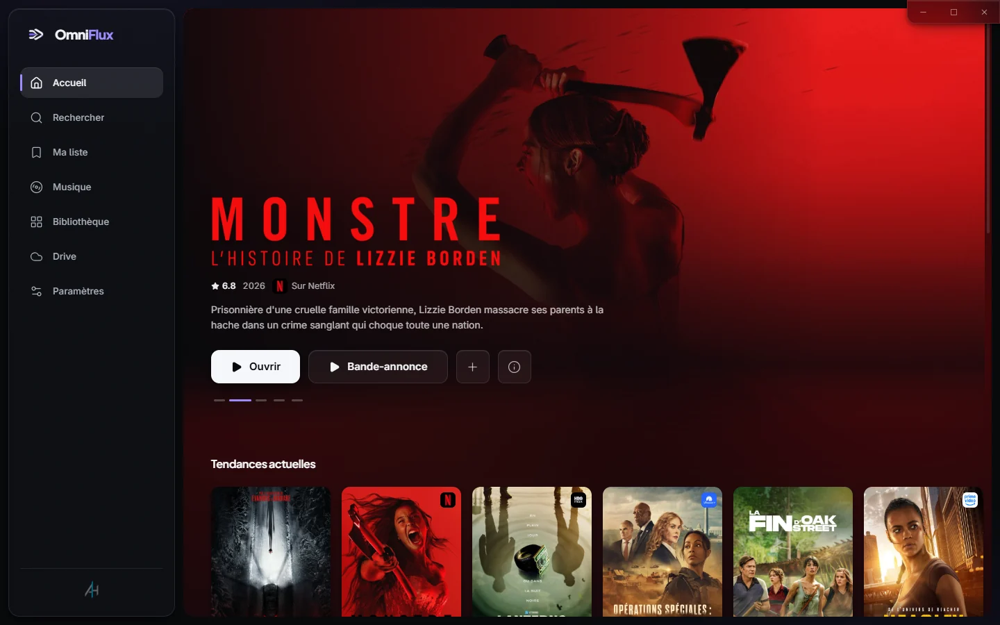
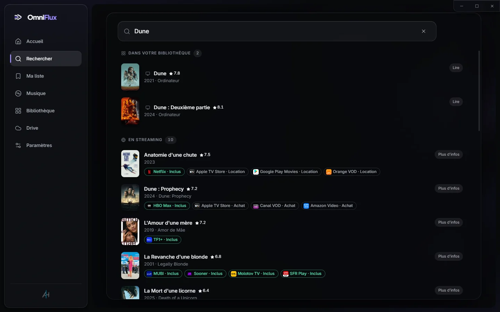
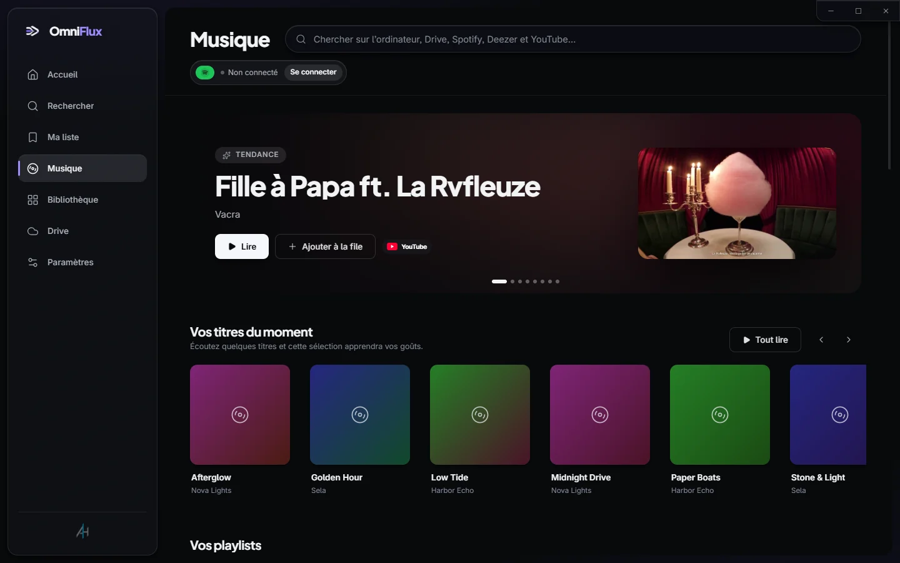
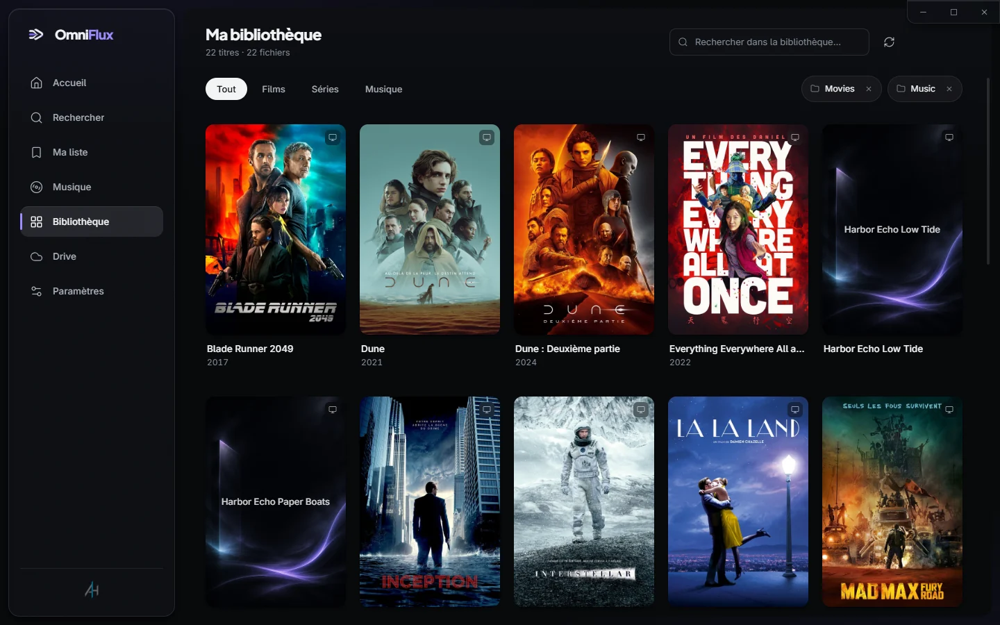
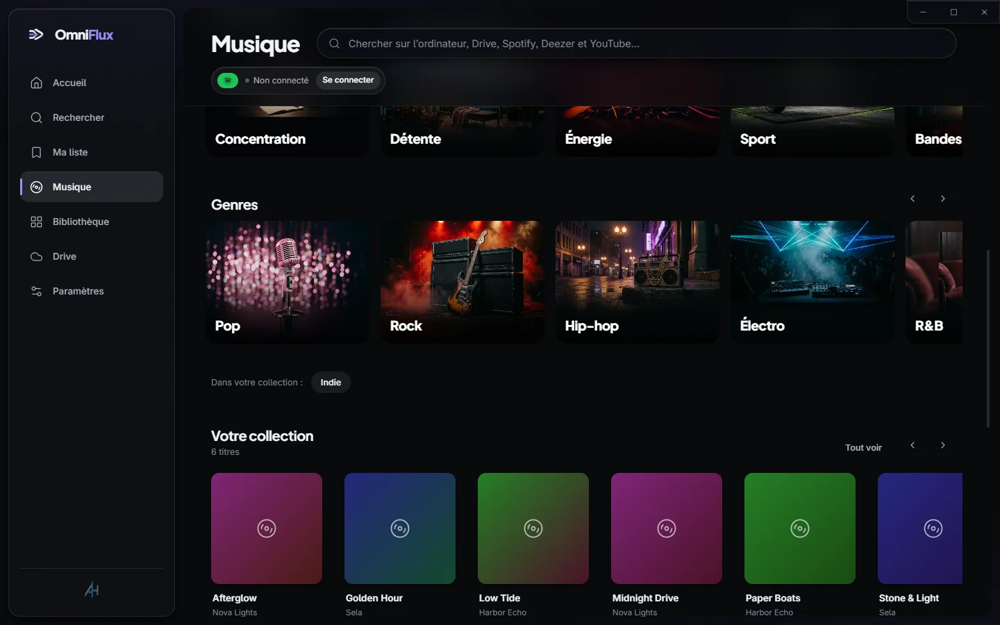

# OmniFlux Player

**Tout ce que vous regardez et écoutez. Une seule app.**

Une application gratuite et open source pour Windows. Trouvez n’importe quel film ou série et voyez sur quelle plateforme il est disponible, regardez la bande-annonce, ajoutez-le à votre liste — ou lisez vos propres fichiers, Google Drive, YouTube et votre musique avec un vrai lecteur mpv.

[**Télécharger pour Windows**](https://github.com/5645hm-a11y/omniflux-player-releases/releases/latest) · [Site web](https://5645hm-a11y.github.io/omniflux-player/) · [English](README.md)

## Fonctions

| | |
|---|---|
| 🍿 **Où regarder** | Une seule recherche sur Netflix, Prime Video, Disney+, Max, Apple TV+, Canal+ et bien d’autres, selon votre pays. Chaque résultat indique où le titre est inclus, où le louer et où l’acheter. |
| ⭐ **Vos abonnements d’abord** | Cochez les services auxquels vous êtes abonné : les titres qui y sont inclus sont signalés et affichés en premier. |
| 🔥 **Tendances, bandes-annonces, Ma liste** | Les films et séries de la semaine, des bandes-annonces lues dans l’appli, la distribution, les notes, et une liste « à voir plus tard ». |
| 🎬 **Lit absolument tout** | Basé sur [mpv](https://mpv.io) : MKV, 4K HDR, HEVC, AV1, FLAC et tous les sous-titres. Sans pack de codecs. |
| 🗂️ **Une vraie bibliothèque** | Les noms de fichiers deviennent des titres avec affiches, années, notes, saisons et épisodes. |
| ☁️ **Google Drive comme serveur multimédia** | Lecture directe depuis Drive, avance rapide instantanée, passages déjà vus en cache. |
| 🎵 **Toute votre musique, une seule file** | Vos fichiers, Drive, YouTube, Deezer et Spotify dans une seule recherche, et des playlists qui mélangent toutes les sources. |
| 🔒 **Privé par conception** | Pas de serveur, pas de compte chez nous. Les recommandations sont calculées sur votre PC. |
| 🌍 **8 langues** | Français, anglais, espagnol, allemand, italien, portugais, arabe et hébreu. |

## Captures

<table>
<tr>
<td width="50%"> <b>Recherche :</b> votre bibliothèque d’abord, puis toutes les plateformes</td>
<td width="50%"> <b>Musique :</b> tendances, pour vous, vos playlists</td>
</tr>
<tr>
<td> <b>Bibliothèque</b></td>
<td> <b>Ambiances & genres</b></td>
</tr>
</table>

## Ce qui marche aujourd’hui

Ce sont des limites fixées par les services, pas par OmniFlux :

- **Vos fichiers, Google Drive et YouTube** fonctionnent pour tous. YouTube est lu dans le lecteur officiel intégré, publicités comprises.
- **Deezer :** recherche dans tout le catalogue et extraits de 30 secondes, clairement signalés, sans compte.
- **Spotify est sur invitation.** Spotify limite désormais les applis indépendantes à quelques comptes approuvés. Tous les autres reçoivent un message clair, et les autres sources continuent de fonctionner.
- **La connexion à Google Drive** affiche un écran « application non validée » tant que Google n’a pas terminé sa vérification. Cliquez sur *Paramètres avancés → Continuer*. OmniFlux ne demande qu’un accès en lecture.

## Installation

1. Téléchargez `OmniFlux-<version>-setup.exe` depuis la page des [versions](https://github.com/5645hm-a11y/omniflux-player-releases/releases/latest).
2. Windows SmartScreen peut indiquer un éditeur inconnu, car l’installateur n’est pas encore signé. Cliquez sur *Informations complémentaires → Exécuter quand même*.
3. Les mises à jour se téléchargent en arrière-plan et s’installent à la prochaine fermeture.

## Compiler depuis les sources

Voir le [README en anglais](README.md#build-from-source). En résumé : `npm install`, copiez `.env.example` vers `.env` avec vos propres clés, puis `npm run dev`. **Aucune clé n’est jamais versionnée.**

## Licence

[GPL-3.0](LICENSE). OmniFlux inclut [mpv](https://mpv.io) (GPL), exécuté comme processus séparé.

Ce produit utilise l’API TMDB mais n’est ni approuvé ni certifié par TMDB. Netflix, Prime Video, Disney+, Max, Spotify, YouTube, Deezer et Google Drive sont des marques de leurs propriétaires ; OmniFlux n’y est pas affilié. Voir la [politique de confidentialité](PRIVACY.md).
