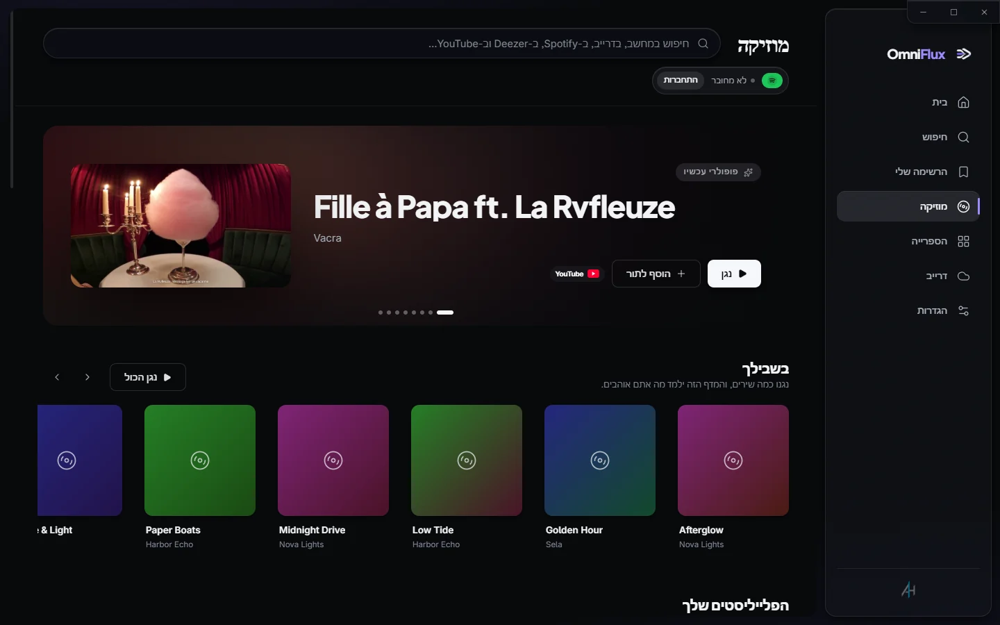
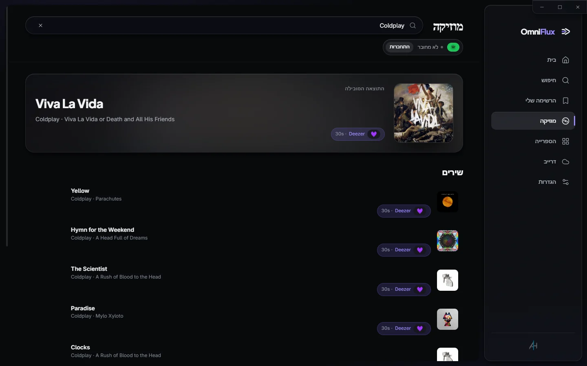
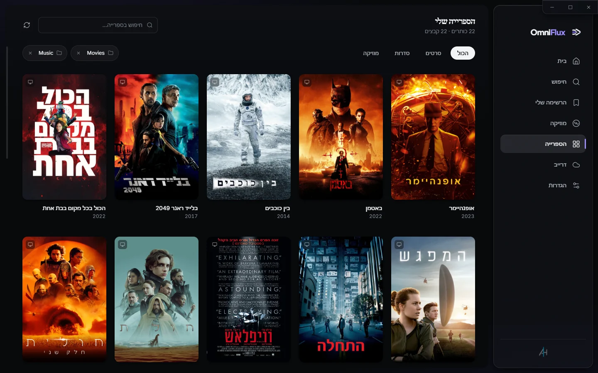
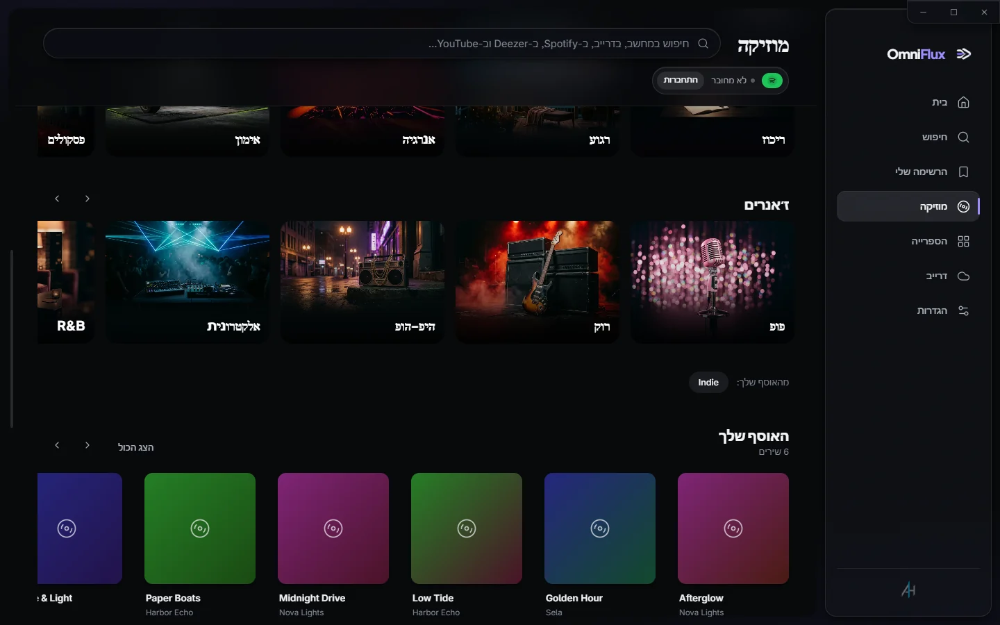

# OmniFlux Player

**כל סרט, כל שיר וכל תיקייה בדרייב. נגן אחד.**

נגן מדיה חינמי בקוד פתוח ל-Windows. הוא מנגן כל פורמט עם mpv, הופך את התיקיות ואת הדרייב שלכם לספרייה עם כרזות, ומחפש במחשב, ב-YouTube, ב-Deezer וב-Spotify משורת חיפוש אחת.

[**הורדה ל-Windows**](https://github.com/5645hm-a11y/omniflux-player-releases/releases/latest) · [אתר](https://5645hm-a11y.github.io/omniflux-player/) · [English](README.md)

## מה יש בו

- 🎬 **מנגן הכול:** בנוי על mpv. ‏MKV, ‏4K HDR, ‏HEVC, ‏AV1, ‏FLAC וכל סוג כתוביות, בלי חבילות קודקים.
- 🗂️ **ספרייה אמיתית:** שמות קבצים הופכים לכותרים עם כרזות, שנים, דירוגים, עונות ופרקים.
- ☁️ **הדרייב כשרת מדיה:** צפייה ישירה מהדרייב עם דילוג מיידי. מה שכבר נצפה נשמר במחשב.
- 🔎 **חיפוש אחד לכול:** הקבצים, הדרייב, YouTube, ‏Deezer ו-Spotify. כל שיר מופיע פעם אחת, ואתם בוחרים מאיפה לנגן.
- 🎵 **תור אחד מכל המקורות:** FLAC מהמחשב, אחריו סרטון מ-YouTube ואחריו קובץ מהדרייב. אפשר לשמור את התור כפלייליסט.
- 🔒 **פרטיות:** אין שרת ואין חשבון אצלנו. ההמלצות מחושבות במחשב שלכם.
- 🌍 **8 שפות:** כולל עברית וערבית, עם פריסה שמתהפכת באמת.

## צילומי מסך

<table>
<tr>
<td width="50%"></td>
<td width="50%"></td>
</tr>
<tr>
<td></td>
<td></td>
</tr>
</table>

## מה עובד היום

אלה מגבלות של השירותים, לא של OmniFlux:

- **הקבצים שלכם, הדרייב ו-YouTube:** זמינים לכולם. ‏YouTube מתנגן בנגן הרשמי, כולל הפרסומות שלו.
- **Deezer:** חיפוש בכל הקטלוג וקטעים של 30 שניות, מסומנים בבירור, בלי חשבון.
- **Spotify זמין בהזמנה בלבד.** מאז 2026 ‏Spotify מגביל אפליקציות עצמאיות לרשימה קטנה של חשבונות מאושרים. מי שאינו ברשימה יקבל הודעה ברורה, וכל שאר המקורות ממשיכים לעבוד.
- **התחברות לדרייב** מציגה מסך "אפליקציה לא מאומתת" עד ש-Google תסיים לבדוק את OmniFlux. לוחצים *מתקדם ← המשך*. ‏OmniFlux מבקש גישת קריאה בלבד.

## התקנה

1. מורידים את `OmniFlux-<גרסה>-setup.exe` מ[דף הגרסאות](https://github.com/5645hm-a11y/omniflux-player-releases/releases/latest).
2. ייתכן ש-Windows יזהיר על "מפרסם לא ידוע", כי קובץ ההתקנה עוד לא חתום. לוחצים *מידע נוסף ← הפעל בכל זאת*.
3. עדכונים יורדים ברקע ומותקנים בסגירה הבאה של התוכנה.

## בנייה מהקוד

ההוראות המלאות נמצאות ב[README באנגלית](README.md#build-from-source). בקצרה: `npm install`, מעתיקים את `.env.example` ל-`.env` וממלאים מפתחות משלכם, ואז `npm run dev`. **מפתחות לעולם אינם נכנסים ל-git.**

## רישיון

[GPL-3.0](LICENSE). התוכנה כוללת את [mpv](https://mpv.io) (GPL), שרץ כתהליך נפרד.

המוצר משתמש ב-API של TMDB, אך אינו מאושר או מוסמך על ידי TMDB. ‏Spotify, ‏YouTube, ‏Deezer ו-Google Drive הם סימנים מסחריים של בעליהם, ו-OmniFlux אינו קשור אליהם. ראו [מדיניות הפרטיות](PRIVACY.md).

