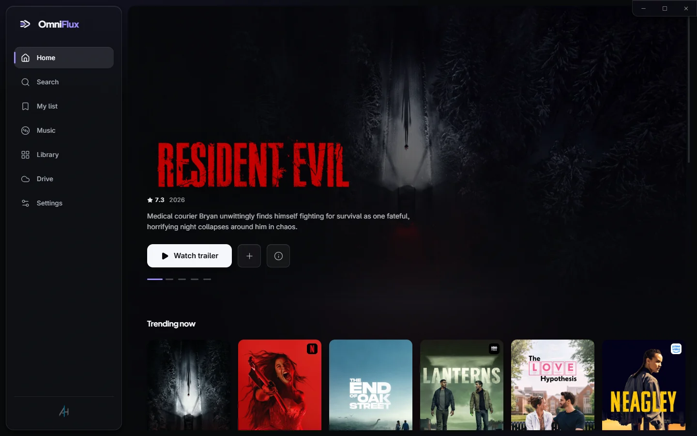
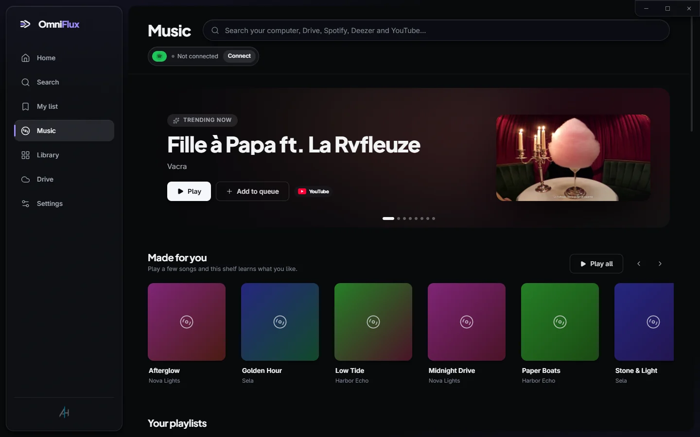
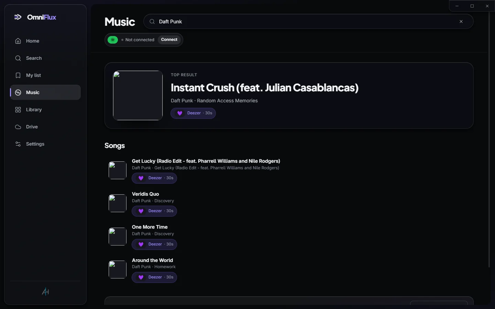
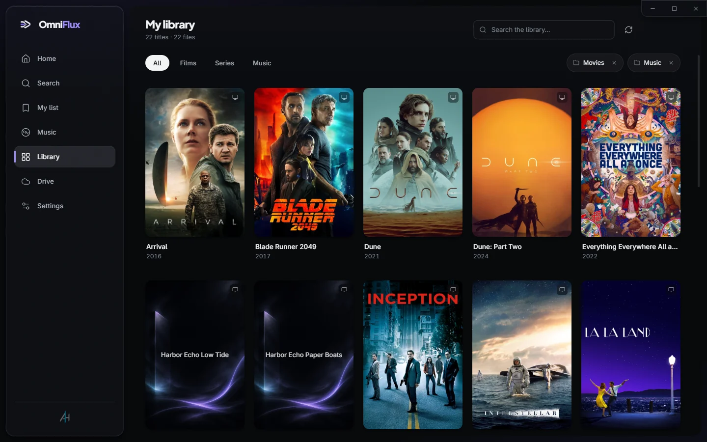
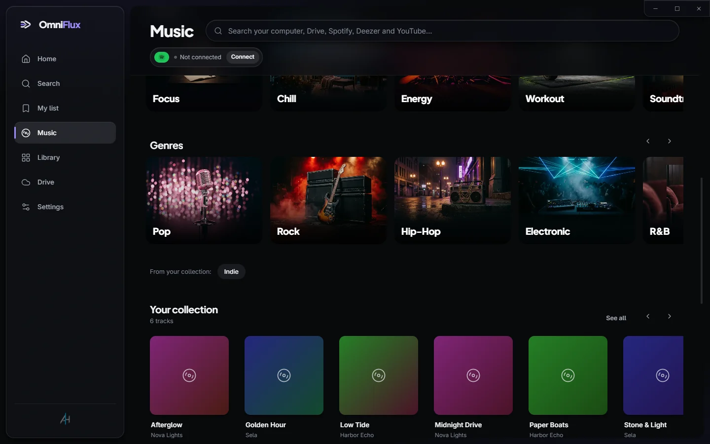
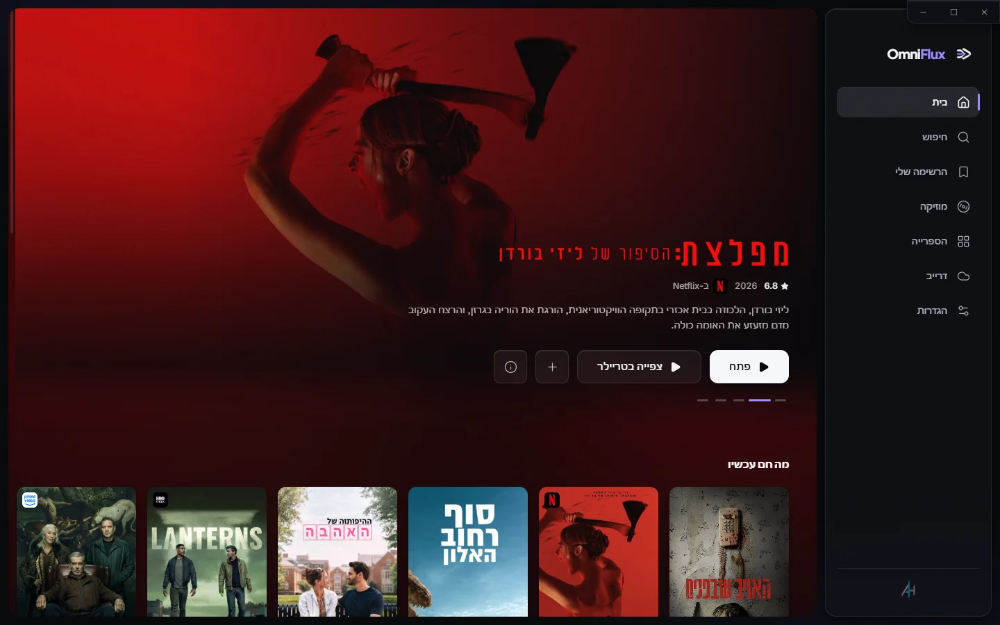
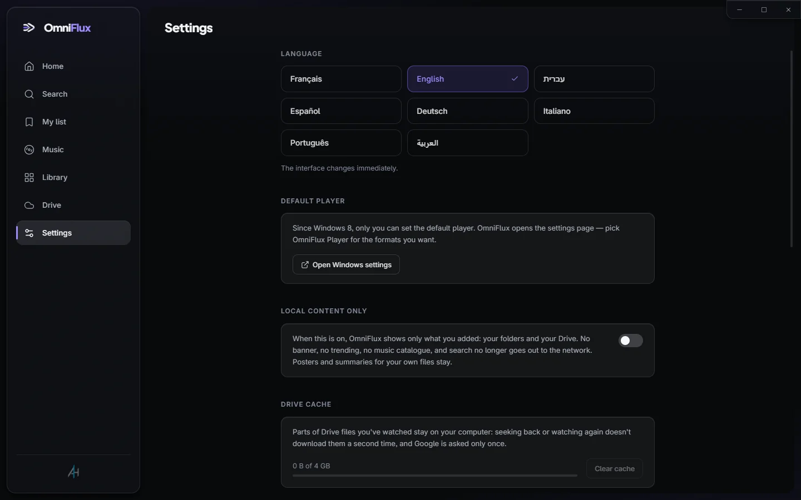

<div align="center">


# OmniFlux Player

**Every movie, song and Drive folder. One player.**

A free, open-source media player for Windows. It plays every format with mpv, turns your folders and Google Drive into a poster library, and searches your computer, YouTube, Deezer and Spotify from one search box.

[**Download for Windows**](https://github.com/5645hm-a11y/omniflux-player-releases/releases/latest) · [Website](https://5645hm-a11y.github.io/omniflux-player/) · [עברית](README.he.md)

[](https://github.com/5645hm-a11y/omniflux-player-releases/releases/latest)
[](LICENSE)




</div>

## Features

| | |
|---|---|
| 🎬 **Plays everything** | Built on [mpv](https://mpv.io): MKV, 4K HDR, HEVC, AV1, FLAC and every subtitle format. No codec packs. |
| 🗂️ **A real library** | File names become titles with posters, years, ratings, seasons and episodes, in your language. |
| ☁️ **Google Drive as a media server** | Stream straight from Drive with instant seeking. Watched parts are cached locally. |
| 🔎 **One search for everything** | Your files, Drive, YouTube, Deezer and Spotify in one box. Each song appears once, and you pick where it plays from. |
| 🎵 **One queue across sources** | Play a local FLAC, then a YouTube video, then a Drive file, without switching apps. Save the queue as a playlist. |
| 🔒 **Private by design** | No server and no account on our side. Recommendations are computed on your PC. |
| 🌍 **8 languages, real RTL** | English, Hebrew, Arabic, French, Spanish, German, Italian and Portuguese. |

## Screenshots

<table>
<tr>
<td width="50%"><br /><sub><b>Music:</b> trending, made for you, your playlists</sub></td>
<td width="50%"><br /><sub><b>Unified search:</b> one result per song, with a source picker</sub></td>
</tr>
<tr>
<td><br /><sub><b>Library:</b> your folders, with posters</sub></td>
<td><br /><sub><b>Moods & genres</b></sub></td>
</tr>
<tr>
<td><br /><sub><b>Right-to-left:</b> the whole layout flips</sub></td>
<td><br /><sub><b>Settings:</b> 8 languages, local-only mode, Drive cache</sub></td>
</tr>
</table>

## What works today

These are limits set by the services, not by OmniFlux:

- **Your files, Google Drive and YouTube** work for everyone. YouTube plays in the official embedded player, ads included.
- **Deezer:** you can search the whole catalog and play 30-second previews, clearly marked, without an account.
- **Spotify is invite-only.** Since 2026, Spotify limits independent apps to a handful of approved accounts. Anyone else sees a clear message; every other source keeps working.
- **Google Drive sign-in** shows an "unverified app" screen until Google finishes reviewing OmniFlux. Click *Advanced → Continue*. OmniFlux asks for read-only access.

## Install

1. Download `OmniFlux-<version>-setup.exe` from [Releases](https://github.com/5645hm-a11y/omniflux-player-releases/releases/latest).
2. Windows SmartScreen may warn that the publisher is unknown, because the installer isn't code-signed yet. Click *More info → Run anyway*.
3. Updates download in the background and install the next time you close the app.

## Build from source

Requirements: Windows 10/11, Node.js 22+, Git.

```sh
git clone https://github.com/5645hm-a11y/omniflux-player
cd omniflux-player
npm install          # also downloads the mpv engine
cp .env.example .env # add your own API keys, see below
npm run dev
```

| Command | What it does |
|---|---|
| `npm run dev` | Run with hot reload |
| `npx electron-vite build` | Build into `out/` (the tests run against `out/`, so build first) |
| `npm test` | 340+ unit and end-to-end tests (Playwright) |
| `npm run typecheck` | TypeScript |
| `npm run dist` | Windows installer in `release/` |

### API keys

**Keys are never committed.** At build time, every variable starting with `MAIN_VITE_` in `.env` is compiled into the app. Every integration is optional, and a missing key only turns that feature off. See [`.env.example`](.env.example) for where to get each one.

> [!NOTE]
> Spotify playback needs Widevine DRM. OmniFlux uses [CastLabs Electron](https://github.com/castlabs/electron-releases), and production builds must be VMP-signed with your own free [castlabs EVS](https://github.com/castlabs/electron-releases/wiki/EVS) account (`tools/vmp-sign.cjs` runs this automatically). Set `OMNIFLUX_SKIP_VMP=1` to build without it; everything except Spotify still works.

## Project layout

```
src/
  main/          main process: mpv engine, windows, IPC, services (Drive, Spotify, YouTube…)
  preload/       the single bridge between UI and main
  renderer/      UI: React 19, Tailwind, zustand
  shared/        contracts, i18n (8 locales), pure logic such as unified music search
  core/          library scanning and search
  adapters/      providers: TMDB, Deezer, Spotify, YouTube, Drive
tests/           end-to-end tests
tools/           engine download, signing, screenshots, live QA
docs/            architecture, music strategy, QA checklist, mobile roadmap
```

Further reading: [architecture notes](docs/ARCHITECTURE.md), [music strategy](docs/MUSIC_STRATEGY.md), [QA checklist](docs/QA_CHECKLIST.md) and [mobile roadmap](docs/MOBILE_ROADMAP.md). Most internal docs and code comments are in Hebrew.

## Contributing

Issues and pull requests are welcome. See [CONTRIBUTING.md](CONTRIBUTING.md). To report a security problem, see [SECURITY.md](SECURITY.md).

## License

OmniFlux is licensed under the [GNU General Public License v3.0](LICENSE).

It bundles [mpv](https://mpv.io) (GPL), run as a separate process. Its license ships with every install in `resources/engine/LICENSES`.

<sub>This product uses the TMDB API but is not endorsed or certified by TMDB. Spotify, YouTube, Deezer and Google Drive are trademarks of their respective owners; OmniFlux is not affiliated with or endorsed by them. See the [privacy policy](PRIVACY.md).</sub>
